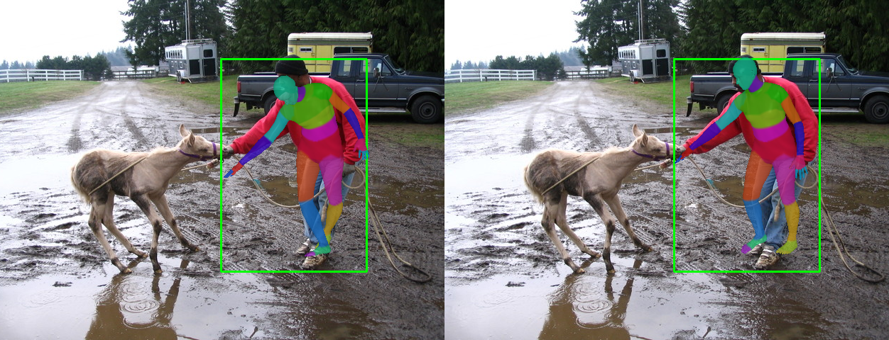
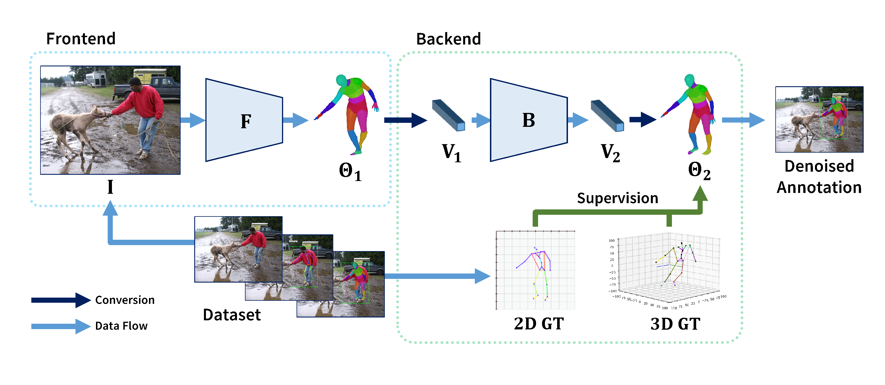
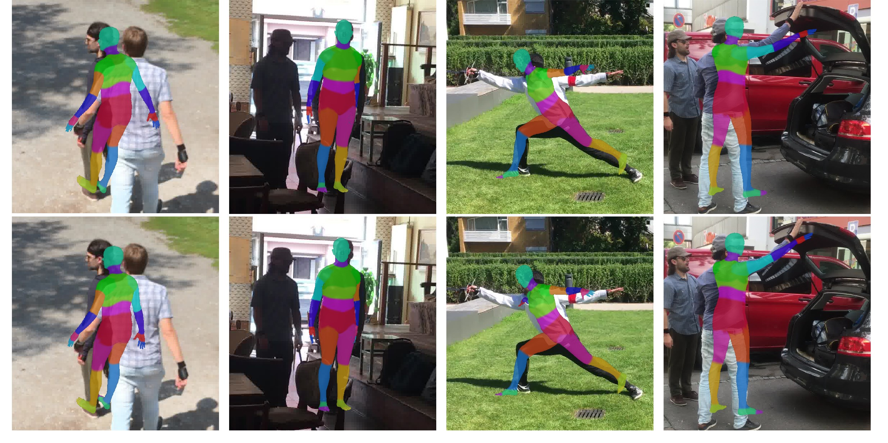
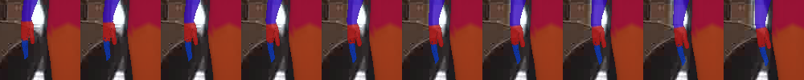
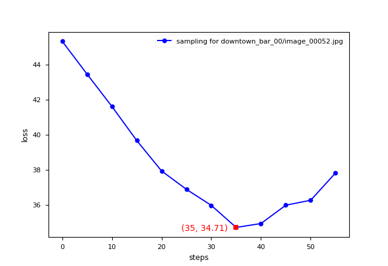

## DiffAnnot: Improved Neural Annotator with Denoising Diffusion Model

> Accepted by ICIPMC 2023.

Authors: [Chaofan Lin](https://github.com/SiriusNEO), [Tianyuan Qiu](https://github.com/PaperL), [Hanchong Yan](https://github.com/brandon-yan), [Muzi Tao](https://github.com/Seanzzia)

- [Source Code](https://github.com/PaperL/Human-3D-Diffusion)

- [Paper In PDF](DiffAnnot.pdf)

This project uses [MMHuman3D](https://github.com/open-mmlab/mmhuman3d/).

### Abstract

3D human reconstruction is an important task in computer vision to generate human 3D models from photos or videos. But the research of reconstruction requires human body data with annotation.  Previous widely used neural-network-based annotators annotate 3D human models automatically but there is still room for quality improvement. In our research, we innovatively regard the deviation between the annotations and true human poses as a type of noise. We propose a new annotator DiffAnnot using a denoising diffusion model to further refine the annotations from a pre-trained annotator. We train and test DiffAnnot on various datasets including 3DPM, MPI-INF-3DHP and Halpe. DiffAnnot is evaluated on several widely used metrics including MPJPE and shows outstanding performance.

### Architecture

DiffAnnot architecture overview. **Dataset** provides original image as model input **I** and **2D/3D ground truth**(joint coordinates) as supervision. **Frontend** takes input image **I** and uses pre-trained HMR model **F** to get rudimentary parameters **Theta1**. **Backend** first coverts **Theta1** to a flatten vector **V1**. The diffusion model **B** denoises **V1** and gets vector **V2**. Then **V2** is restored to parameters **Theta2**. **2D/3D ground truth** is used to calculate loss with **Theta2**. The loss supervises **B** to learn a data distribution for denoising. In evaluation, **Theta2** is the **denoised annotation** as the result of DiffAnnot.

### Examples of Annotations

Comparison of several 3D human annotation visualization between HMR and DiffAnnot. (Above: HMR Results; Below: Our Results.)

### Visualization of the Denoising Process

Visualization of steps in the sampling progress. (From left to right, denoising step 0 to step 57.)

We can see that the arm is gradually put down as the sampling steps increase. And according to the following figure, the loss first decreases but then there is an increase again. In step 35, the arm is lowered to the most suitable location which achieves minimal loss.

### Credit

SJTU Course CS348: Computer Vision (2022 Fall) Team B Project.

This page is maintained by CS348 - Group B.

HMR Model: [open-mmlab/mmhuman3d](https://github.com/open-mmlab/mmhuman3d)

Diffusion Model: [openai / improved-diffusion](https://github.com/openai/improved-diffusion) 
